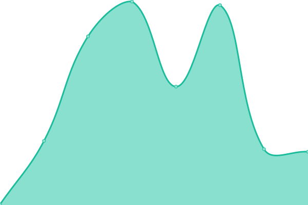
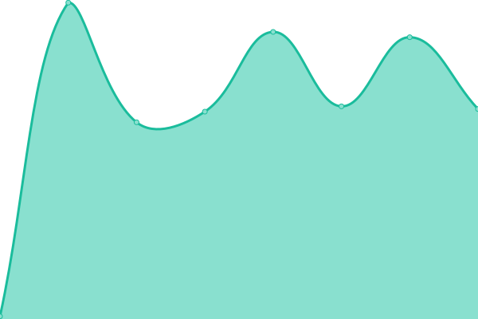

# [📈 Live Status](https://melodyover.github.io/upptime): <!--live status--> **🟩 All systems operational**

<!--start: status pages-->
<!-- This summary is generated by Upptime (https://github.com/upptime/upptime) -->
<!-- Do not edit this manually, your changes will be overwritten -->
<!-- prettier-ignore -->
| URL | Status | History | Response Time | Uptime |
| --- | ------ | ------- | ------------- | ------ |
|  Blog | 🟩 Up | [blog.yml](https://github.com/melodyover/upptime/commits/HEAD/history/blog.yml) | 

 316ms
     
 | 

<a href="https://melodyover.github.io/upptime/history/blog">100.00%</a>
    

|  Api | 🟩 Up | [api.yml](https://github.com/melodyover/upptime/commits/HEAD/history/api.yml) | 

 97ms
     
 | 

<a href="https://melodyover.github.io/upptime/history/api">100.00%</a>
    

<!--end: status pages-->undefined
